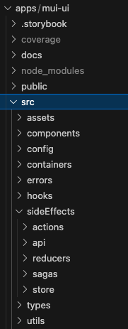

# OMS UI

OMS UI project.

- [Adding Data Sources](#adding-data-sources)
- [Code Structure](#code-structure)
- [Development guidelines](#development-guidelines)
- [Lineage](#lineage)

Technologies:

- Typescript, React
- State and server connection: redux, graphql
- Styling: Sass
- GTS: Eslint and Prettier
- Testing: React Testing Library

## Quick start

Navigate to root of project:

```shell
yarn
```

Run the app:

```shell
yarn start
```

## Adding Data Sources

It is possible to add a Data Source (for example Redshift) to OMS system. The Data Source should exist in AppSync, the Data Source name should be unique and all the fields referenced in the config file should be provided.

1. Create the Data Source config file (see [DeltaLake config file](./apps/mui-ui/src/config/DeltaLake.config.tsx) as example):

```js
...
// Headers to show in the Assets List Page
const gridHeaders: GridColumnHeader[] = [
  ...
  {
    name: 'businessMetadata.asset_name',
    label: 'Table',
    width: '28%',
    filter: {
      type: 'text',
      remoteSearchFields: ['asset_name'],
    },
  },
  {
    name: 'technicalMetadata.env',
    label: 'Environment',
    width: '9%',
    // Filter by aggregation: the aggregation data should be available in aggregations query
    filter: {
      type: 'aggregation',
      aggregationName: 'env_aggregation',
      remoteSearchFields: ['env'],
      hidden: process.env.REACT_APP_ENVIRONMENT === 'production',
      filterSelectProps: {
        isClearable: true,
      },
    },
  },
  // This field could be customized in step 3
  { name: 'links', label: 'Links', width: '12%' },
  ...
];

// Attributes to display in the Asset Metadata Page
const attributesMap: Attribute[] = [
  ...
  //
  {
    // This name should exists in the fields of AppSync
    name: 'sourceSpecificMetadata.Redshift.table_size_bytes',
    label: 'Table Size',
    showInColumn: 0,
    // optional prefix for field values
    suffix: ' bytes',
  },
  {
    name: 'technicalMetadata.operationalMetadata.vcs',
    label: 'Version Control',
    type: 'link',
    isEditable: true,
    showInColumn: 1,
    remoteSaveField: 'vcs',
  },
  {
    name: 'technicalMetadata.securityAndComplianceMetadata.business_segment',
    label: 'Business Segment',
    // If the attribute type is array, the data will be display as list
    type: 'array',
    showInColumn: 3,
  },
  ...
];

// Specific metadata fields required for the Data Source in Assets List Page
const customQueryForListPage = `
  Redshift {
    database_name
    schema_name
  }
`;

// Specific metadata fields required for the Data Source in Asset Metadata Page
const customQueryForDetailsPage = `
  Redshift {
    database_name
    documentation
    deleted
    is_cloned
    fail_safe_bytes
    retained_for_clone_bytes
    row_count
    schema_name
    table_id
    table_size_bytes
    time_travel_bytes
    columns {
      columnName
      description
      dataType
      defaultValue
      nullable
    }
    custom_fields {
      name
      value
    }
  }
`;

export const RedshiftConfig: DataSource = {
  id: '3',
  name: 'Redshift',
  showPartitionColumns: true,
  gridHeaders,
  attributesMap,
  customQueryForListPage,
  customQueryForDetailsPage,
};

```

2. Configure the new Data Source in **Data Sources Config File** [apps/mui-ui/src/config/dataSources.config.ts](./apps/mui-ui/src/config/dataSources.config.ts)

3. Create a component to handle each custom field in Assets List Page: [Custom Components folder](./apps/mui-ui/src/components/Asset/AssetRow/AssetRowCustomComponents/) and map them in [AssetRowValueElement.tsx](./apps/mui-ui/src/components/Asset/AssetRow/AssetRowValueElement.tsx)

4. Configure custom management of fields in Asset Metadata Page in the [apiAssetToAttributes() function](./apps/mui-ui/src/containers/TableDetails/controllers/tableDetailsUtils.ts)

## Code structure



- ...
- Components: Components focused in render the UI
- Config: Data Sources configuration files
- Containers: Components with business logic, app state managing and data fetching
- ...
- sideEffects: Contains functions to manage the app state and data fetching

## Development guidelines

- [Types](#types)
- [Styling](#styling)
- [Forms](#forms)
- [State management](#state-management)
- [Testing](#testing)
- [Deployment](#deployment)
- [SSO Authentication](#sso-authentication)
- [AppSync connection, GraphQL](#appsync-connection-graphql)

### Types

Types are grouped by use in the system:

- [api.types.ts](./apps/mui-ui/src/types/api.types.ts): types to map the data requested or responded by the server
- [entities.types.ts](./apps/mui-ui/src/types/entities.types.ts): directly related business types
- [user.types.ts](./apps/mui-ui/src/types/user.types.ts): types to manage user and roles information
- [utils.types.ts](./apps/mui-ui/src/types/utils.types.ts): types not related with previous classification and transversal to the app

### Styling

We are using [SCSS](https://sass-lang.com/) as our principal file type for
styling the application, we support light and dark mode.

To handle what colors should we use for each, we have defined global color variables to reuse across the app.

### Forms

We are using [React Hook Forms](https://react-hook-form.com/) to gather and send information in forms like attributes edition and columns edition. This is the preferred way to use forms, using its not-controlled fields feature.

In filters, due we need the ability to detect each key pressing we are using plain fields. To avoid unnecessary calls to the server we use a debounce hook: [useDebounce.tsx](./apps/mui-ui/src/hooks/useDebounce.tsx)

### State management

#### Session Storage

Here we store session information (see [SSO Authentication](#sso-authentication) for more details), variables :

- code: is the Authorization Code to exchange for access token
- idToken: Access Token
- roles: roles available for the current user extracted for the Access Token
- expiresIn: expiration time in seconds of the Access Token
- redirectURI: URI from the app was accessed
- refreshToken: token to exchange for a new Access Token when required

#### App State

Refers to the global state of the application that is necessary across multiple components and throughout the entire lifecycle of the app.

This is managed by Redux, actions, reducers, store and sagas could be found in [sideEffects](./apps/mui-ui/src/sideEffects/).


- **user**: information provided by the JWT Access Token

- **gui**: data related with the state of Graphical User Interface components that requires variables across the app (like the toast messages)

- **app**: state for business logic that needs to be persisted between views (like selected Data Source, filters applied or the Data Sources configuration)

#### Components State

State that is held by container components or by self-contained components like Grid. This state could be managed by:

- **Context**: Only when required to avoid prop-drilling. Example: [Grid component](./apps/mui-ui/src/components/Grid/Grid.tsx)

- **Props**: Data passed down from a parent component to a child component.

#### Local State

Local state managed by pure components which receive the state by props or keep a local state without side effects.

### Testing

Create a `__test__` folder for each component test and inside a tests file named as `MyComponent.test.tsx`.

In order to run the tests navigate to [mui-iu](./apps/mui-ui/) folder.

To run all the tests and validate coverage:

```bash
yarn test:coverage
```

To run a test for a specific component and watch updates:

```bash
yarn test:watch MyComponent.test
```

### Deployment

The develop and deploy process involves multiple branches which correspond to different environments

> `sandbox` branch which corresponds to [sandbox environment](https://sb.oms.disn.io)\
> `devel` branch which corresponds to [dev environment](https://dev.oms.disn.io)\
> `main` branch which corresponds to [production environment](https://oms.disn.io)

There are multiple steps from initial development in feature branches to final deployment to the `main` branch. Here's a step-by-step guide to our deployment workflow:

#### Flow

1. **Pull from `sandbox`**: `main` is our default branch, but developers will want to switch to and pull the latest changes from the `sandbox` branch for new features.

2. **Create Feature Branch**: From the `sandbox` branch, create a new feature branch for your work. Give the branch a unique and descriptive name. This can include your Jira ticket number and feature name. For example: `feature/feature/DPTGROGU-12009-create-modal-button`.

3. **Work on Feature**: Implement your feature, fix bugs, or make improvements within this branch. Commit your changes regularly and push them to the remote repository. Testing and validation can be performed locally against different environments using the following scripts:

```bash
    yarn start:sandbox # tests against sandbox environment data
    yarn start:dev # tests against development environment data
    yarn start # tests against production environment data
```

4. **Create Pull Request to `sandbox`**: Once your work on the feature branch is complete and tested locally, create a pull request (PR) to merge your changes into the `sandbox` branch. This PR will be reviewed by peers for code quality and functionality.

5. **Merge Branch Into `sandbox`**: The responsible team members will merge the PR from the feature branch to `sandbox` and approve the deploy job in Jenkins.

6. **Monitor**: After deploying team members will continue to test and monitor for issues. If any are found, it is the responsibility of the involved team members to either fix or revert these changes ASAP so that our branches can be in a working state for additonal development.

7. **Other Environments**: The process is the same from `sandbox` to `devel` and from `devel` to `main`. Production deploys have the added formality of a scheduled deploy meeting during a change request window where team members can troubleshoot together in case something goes wrong.

8. **More**: More details on the OMS team development and deployment process, including rollbacks, can be found [here](https://confluence.disney.com/spaces/DTCIDPP/pages/1651587365/OMS+Engineering+Development+and+Deployment).

### SSO Authentication

Single Sign-On (SSO) allows users to access multiple applications with one login, improving convenience and security. After initial authentication, users can seamlessly enter connected systems without signing in again, thanks to a central server that verifies identity and issues access tokens. SSO is commonly implemented using standards like SAML, OAuth, and OpenID Connect.

SSO is the authentication method we use in OMS UI. The process is:

- The user attempts to access an application, so if is not authenticated is redirected to SSO server, if the user authenticate successfully in the SSO Server, it redirects to OMS again, returning an Authorization Code param in the url, the [OIDCRedirect](./apps/mui-ui/src/containers/Auth/OIDCRedirect.tsx) component storage the Authorization Code in the session storage

- The [OIDCRedirect](./apps/mui-ui/src/containers/Auth/OIDCRedirect.tsx) component trigger the [getAccessToken](./apps/mui-ui/src/sideEffects/actions/auth.actions.ts) action and its saga [getAccessToken saga](./apps/mui-ui/src/sideEffects/sagas/auth.sagas.ts). This saga get the JWT Access Token, extract the user info and storage in Redux state. The refresh token is saved in the session storage

- The user is redirected to the saved redirection url and the [AuthenticatedRoutes](./apps/mui-ui/src/containers/Auth/AuthenticatedRoutes.tsx) component validates that the user has access to that information, if not, redirect to Not Found page and revoke the session

- Given the expiresIn value returned by the JWT Access Token, the saga [refreshAccessToken](./apps/mui-ui/src/sideEffects/sagas/auth.sagas.ts) will refresh the token every `expiresIn` seconds

- If the SSO server revokes the refresh token, the next time the [refreshAccessToken](./apps/mui-ui/src/sideEffects/sagas/auth.sagas.ts) try to update the token, all the storage data will be erased and the user will be redirected to the [Login](./apps/mui-ui/src/components/Login/Login.tsx) page.

### AppSync connection, GraphQL

We use [Apollo Client](https://www.apollographql.com/docs/react/) to get information from AppSync. Normally this is done in container components like [TablesList](./apps/mui-ui/src/containers/TablesList/TablesList.tsx). The complexity of the query is wrapped in a hook, for example [useGetAssets](./apps/mui-ui/src/containers/TablesList/controllers/useGetAssets.tsx). This hook get the information and process possible errors.

If the user is authenticated and is in a route that requires authentication, the [AuthenticatedRoutes](./apps/mui-ui/src/containers/Auth/AuthenticatedRoutes.tsx) component uses [GraphQLProvider](./apps/mui-ui/src/sideEffects/api/GraphQLProvider.tsx) to provide access to Apollo Client functions that can be used as in the [useGetAssets](./apps/mui-ui/src/containers/TablesList/controllers/useGetAssets.tsx) hook.

Errors are handled by [useApolloErrorHandler](./apps/mui-ui/src/sideEffects/api/useApolloErrorHandler.tsx) hook.

## Lineage

### Neptune Graph Data

Following rules define how to display nodes and relationships between nodes in Lineage viewers. Use of this rules can be found in [LineageViewer.functions.tsx](./apps/mui-ui/src/components/Lineages/LineageViewer/LineageViewer.functions.tsx)

Conventions:

- relationsToLoad: defines if retrieved nodes should be displayed left or right of the node the user clicks
- originVertex: the node the user clicks
- apiEdge: relationship between nodes (as they come from AppSync response)

#### DATASET downstream_of DATASET

- If origin apiEdge.node.\_id === originVertex.id show new node on right (child) side, relation name: ''
- If origin apiEdge.relatedNode.\_id === originVertex.id show new node on left (parent) side, relation name: ''

```js
const datasetUpstreamOfDataset = (
  relationsToLoad: VertexRelationship,
  originVertex: Vertex,
  apiEdge: APIEdge
): boolean =>
  relationsToLoad === "childOf" &&
  originVertex.type === "Dataset" &&
  apiEdge.relationship === "downstream_of" &&
  apiEdge.node.__typename === "Dataset" &&
  apiEdge.relatedNode.__typename === "Dataset" &&
  apiEdge.node._id === originVertex.id;

const datasetDownstreamOfDataset = (
  relationsToLoad: VertexRelationship,
  originVertex: Vertex,
  apiEdge: APIEdge
): boolean =>
  relationsToLoad === "parentOf" &&
  originVertex.type === "Dataset" &&
  apiEdge.relationship === "downstream_of" &&
  apiEdge.node.__typename === "Dataset" &&
  apiEdge.relatedNode.__typename === "Dataset" &&
  apiEdge.relatedNode._id === originVertex.id;
```

#### DATAJOB consumes DATASET

- If origin node is DATASET then show new node on right (child) side, relation name: consumed by
- If origin node is DATAJOB then show new node on left (parent) side, relation name: consumes

```js
const datasetConsumedByDatajob = (
  relationsToLoad: VertexRelationship,
  originVertex: Vertex,
  apiEdge: APIEdge
): boolean =>
  relationsToLoad === "childOf" &&
  originVertex.type === "Dataset" &&
  apiEdge.relationship === "consumes" &&
  apiEdge.node.__typename === "Datajob" &&
  apiEdge.relatedNode.__typename === "Dataset" &&
  apiEdge.relatedNode._id === originVertex.id;

const datajobConsumesDataset = (
  relationsToLoad: VertexRelationship,
  originVertex: Vertex,
  apiEdge: APIEdge
): boolean =>
  relationsToLoad === "parentOf" &&
  originVertex.type === "Datajob" &&
  apiEdge.relationship === "consumes" &&
  apiEdge.node.__typename === "Datajob" &&
  apiEdge.relatedNode.__typename === "Dataset" &&
  apiEdge.node._id === originVertex.id;
```

Example:

```json
{
  "edgeId": "ad4e35afbd965d17b7e6c1a1c6b3f82f",
  "node": {
      "_id": "urn:oms:datajob:(urn:oms:platform:databricks:dss-dsa-prod-us-east-1.cloud.databricks.com:453005943976547):task:meta_entity_external_id_snapshot_-_Prod",
      "name": "meta_entity_external_id_snapshot_-_Prod",
      "desc": "https://dss-dsa-prod-us-east-1.cloud.databricks.com/jobs/453005943976547=?o3066777196544896.meta_entity_external_id_snapshot_-_Prod",
      "__typename": "Datajob"
  },
  "relationship": "consumes",
  "relatedNode": {
      "_id": "urn:oms:dataset:(urn:oms:platform:s3:dataeng-data-prod):prod/data/eva/hourly_snapshots/v3/eva_entity_brand_snapshot",
      "name": "s3://dataeng-data-prod/prod/data/eva/hourly_snapshots/v3/eva_entity_brand_snapshot",
      "desc": "s3://dataeng-data-prod/prod/data/eva/hourly_snapshots/v3/eva_entity_brand_snapshot",
      "__typename": "Dataset"
  }
},
```

#### DATAJOB produces DATASET

- If origin node is DATASET then show new node on left (parent) side, relation name: produces
- If origin node is DATAJOB then show new node on right (child) side, relation name: consumed by

```js
const datasetProducedByDatajob = (
  relationsToLoad: VertexRelationship,
  originVertex: Vertex,
  apiEdge: APIEdge
): boolean =>
  relationsToLoad === "parentOf" &&
  originVertex.type === "Dataset" &&
  apiEdge.relationship === "produces" &&
  apiEdge.node.__typename === "Datajob" &&
  apiEdge.relatedNode.__typename === "Dataset" &&
  apiEdge.node._id === originVertex.id;

const datajobProducesDataset = (
  relationsToLoad: VertexRelationship,
  originVertex: Vertex,
  apiEdge: APIEdge
): boolean =>
  relationsToLoad === "childOf" &&
  originVertex.type === "Datajob" &&
  apiEdge.relationship === "produces" &&
  apiEdge.node.__typename === "Datajob" &&
  apiEdge.relatedNode.__typename === "Dataset" &&
  apiEdge.node._id === originVertex.id;
```

```json
{
  "edgeId": "4eee117da1fdcd855c3053ec64713850",
  "node": {
      "_id": "urn:oms:datajob:(urn:oms:platform:databricks:dss-dsa-prod-us-east-1.cloud.databricks.com:453005943976547):task:meta_entity_external_id_snapshot_-_Prod",
      "name": "meta_entity_external_id_snapshot_-_Prod",
      "desc": "https://dss-dsa-prod-us-east-1.cloud.databricks.com/jobs/453005943976547=?o3066777196544896.meta_entity_external_id_snapshot_-_Prod",
      "__typename": "Datajob"
  },
  "relationship": "produces",
  "relatedNode": {
      "_id": "urn:oms:dataset:(urn:oms:platform:s3:dataeng-data-shared-prod):ds/prod/shared/content_metadata_ds_prod/meta_entity_external_id_snapshot",
      "name": "s3://dataeng-data-shared-prod/ds/prod/shared/content_metadata_ds_prod/meta_entity_external_id_snapshot",
      "desc": "s3://dataeng-data-shared-prod/ds/prod/shared/content_metadata_ds_prod/meta_entity_external_id_snapshot",
      "__typename": "Dataset"
  }
},
```

#### DATAJOB downstream_of DATAJOB

- If origin apiEdge.node.\_id === originVertex.id show new node on right (child) side, relation name: ''
- If origin apiEdge.relatedNode.\_id === originVertex.id show new node on left (parent) side, relation name: ''

```js
const datajobUpstreamOfDatajob = (
  relationsToLoad: VertexRelationship,
  originVertex: Vertex,
  apiEdge: APIEdge
): boolean =>
  relationsToLoad === "childOf" &&
  originVertex.type === "Datajob" &&
  apiEdge.relationship === "downstream_of" &&
  apiEdge.node.__typename === "Datajob" &&
  apiEdge.relatedNode.__typename === "Datajob" &&
  apiEdge.node._id === originVertex.id;

const datajobDownstreamOfDatajob = (
  relationsToLoad: VertexRelationship,
  originVertex: Vertex,
  apiEdge: APIEdge
): boolean =>
  relationsToLoad === "parentOf" &&
  originVertex.type === "Datajob" &&
  apiEdge.relationship === "downstream_of" &&
  apiEdge.node.__typename === "Datajob" &&
  apiEdge.relatedNode.__typename === "Datajob" &&
  apiEdge.relatedNode._id === originVertex.id;
```

#### DATAJOB part_of DATAFLOW

- If origin node is DATAJOB then show new node on left (parent) side, relation name: has
- If origin node is DATAFLOW then show new node on right (child) side, relation name: has

```js
const datajobPartOfDataflow = (
  relationsToLoad: VertexRelationship,
  originVertex: Vertex,
  apiEdge: APIEdge
): boolean =>
  relationsToLoad === "parentOf" &&
  originVertex.type === "Datajob" &&
  apiEdge.relationship === "part_of" &&
  apiEdge.node.__typename === "Datajob" &&
  apiEdge.relatedNode.__typename === "Dataflow" &&
  apiEdge.node._id === originVertex.id;

const dataflowHasDatajob = (
  relationsToLoad: VertexRelationship,
  originVertex: Vertex,
  apiEdge: APIEdge
): boolean =>
  relationsToLoad === "childOf" &&
  originVertex.type === "Dataflow" &&
  apiEdge.relationship === "part_of" &&
  apiEdge.node.__typename === "Dataflow" &&
  apiEdge.relatedNode.__typename === "Datajob" &&
  apiEdge.node._id === originVertex.id;
```

```json
{
  "edgeId": "d5364ea52d00962c8aeed3e97c5e49df",
  "node": {
      "_id": "urn:oms:datajob:(urn:oms:platform:databricks:dss-dsa-prod-us-east-1.cloud.databricks.com:160384666784957):task:meta_program_snapshot_-_Prod",
      "name": "meta_program_snapshot_-_Prod",
      "desc": "https://dss-dsa-prod-us-east-1.cloud.databricks.com/jobs/160384666784957=?o3066777196544896.meta_program_snapshot_-_Prod",
      "__typename": "Datajob"
  },
  "relationship": "part_of",
  "relatedNode": {
      "_id": "urn:oms:dataflow:(urn:oms:platform:databricks:dss-dsa-prod-us-east-1.cloud.databricks.com):job:160384666784957",
      "name": "160384666784957",
      "desc": "https://dss-dsa-prod-us-east-1.cloud.databricks.com/jobs/160384666784957=?o3066777196544896",
      "__typename": "Dataflow"
  }
},
```

#### DATAFLOW part_of PIPELINE

- If origin node is DATAFLOW then show new node on left (parent) side, relation name: has
- If origin node is PIPELINE then show new node on right (child) side, relation name: has

```js
const dataflowPartOfPipeline = (
  relationsToLoad: VertexRelationship,
  originVertex: Vertex,
  apiEdge: APIEdge
): boolean =>
  relationsToLoad === "parentOf" &&
  originVertex.type === "Dataflow" &&
  apiEdge.relationship === "part_of" &&
  apiEdge.node.__typename === "Dataflow" &&
  apiEdge.relatedNode.__typename === "Pipeline" &&
  apiEdge.node._id === originVertex.id;

const pipelineHasDataflow = (
  relationsToLoad: VertexRelationship,
  originVertex: Vertex,
  apiEdge: APIEdge
): boolean =>
  relationsToLoad === "childOf" &&
  originVertex.type === "Pipeline" &&
  apiEdge.relationship === "part_of" &&
  apiEdge.node.__typename === "Pipeline" &&
  apiEdge.relatedNode.__typename === "Dataflow" &&
  apiEdge.node._id === originVertex.id;
```

#### DATAFLOW downstream_of DATAFLOW

- If origin apiEdge.node.\_id === originVertex.id show new node on right (child) side, relation name: ''
- If origin apiEdge.relatedNode.\_id === originVertex.id show new node on left (parent) side, relation name: ''

```js
const dataflowUpstreamOfDataflow = (
  relationsToLoad: VertexRelationship,
  originVertex: Vertex,
  apiEdge: APIEdge
): boolean =>
  relationsToLoad === "childOf" &&
  originVertex.type === "Dataflow" &&
  apiEdge.relationship === "downstream_of" &&
  apiEdge.node.__typename === "Dataflow" &&
  apiEdge.relatedNode.__typename === "Dataflow" &&
  apiEdge.node._id === originVertex.id;

const dataflowDownstreamOfDataflow = (
  relationsToLoad: VertexRelationship,
  originVertex: Vertex,
  apiEdge: APIEdge
): boolean =>
  relationsToLoad === "parentOf" &&
  originVertex.type === "Dataflow" &&
  apiEdge.relationship === "downstream_of" &&
  apiEdge.node.__typename === "Dataflow" &&
  apiEdge.relatedNode.__typename === "Dataflow" &&
  apiEdge.relatedNode._id === originVertex.id;
```

### Platform Updates

Until July 7:

- Snowflake
- Deltalake
- Hive
- Looker Datasets
- Looker Dashboards
- Looker Widgets
- Unity Catalog
- Harmony
- Airflow
- Kinesis
